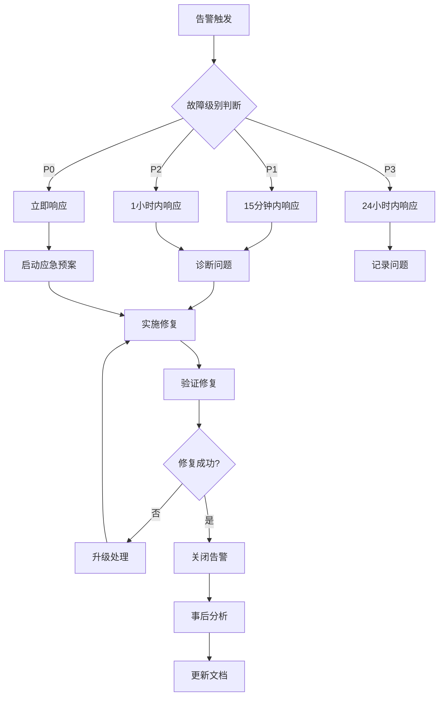

# ETF轮动系统 - 运维手册

## 目录

- [运维概述](#运维概述)
- [日常巡检](#日常巡检)
- [性能监控](#性能监控)
- [告警处理](#告警处理)
- [备份恢复](#备份恢复)
- [扩缩容操作](#扩缩容操作)
- [故障处理](#故障处理)
- [安全运维](#安全运维)
- [版本发布](#版本发布)
- [容量规划](#容量规划)

## 运维概述

### 系统监控指标

| 指标类型 | 关键指标 | 正常范围 | 告警阈值 |
|----------|----------|----------|----------|
| **应用健康** | HTTP响应时间 | < 1s | > 5s |
| | 错误率 | < 1% | > 5% |
| | 吞吐量 | 稳定 | 下降50% |
| **资源使用** | CPU使用率 | < 70% | > 80% |
| | 内存使用率 | < 80% | > 90% |
| | 磁盘使用率 | < 70% | > 85% |
| **数据层** | 数据库连接数 | < 80% | > 90% |
| | Redis命中率 | > 90% | < 80% |
| | 数据库延迟 | < 100ms | > 500ms |

### SLA指标

- **可用性**: 99.9% (月度停机时间 < 43.2分钟)
- **响应时间**: 95分位 < 2秒
- **错误率**: < 1%
- **数据一致性**: 99.99%
- **恢复时间目标(RTO)**: < 15分钟
- **恢复点目标(RPO)**: < 5分钟

## 日常巡检

### 1. 晨间检查清单

```bash
#!/bin/bash
# 日常巡检脚本: daily-check.sh

echo "=== ETF轮动系统日常巡检 $(date) ==="

# 1. 检查集群状态
echo "1. 集群状态检查"
kubectl get nodes
kubectl get pods -n etf-rotation-prod

# 2. 检查应用健康状态
echo "2. 应用健康状态"
kubectl get pods -n etf-rotation-prod -l app.kubernetes.io/name=etf-rotation
kubectl get services -n etf-rotation-prod

# 3. 检查资源使用
echo "3. 资源使用情况"
kubectl top pods -n etf-rotation-prod
kubectl top nodes

# 4. 检查应用响应
echo "4. 应用响应检查"
curl -s http://etf-rotation.your-domain.com/health | jq .

# 5. 检查告警状态
echo "5. 告警状态检查"
curl -s "http://alertmanager:9093/api/v1/alerts" | jq '.data[] | select(.state=="firing")'

# 6. 检查备份状态
echo "6. 备份状态检查"
kubectl get cronjobs -n etf-rotation-prod
kubectl get jobs -n etf-rotation-prod --sort-by=.metadata.creationTimestamp

# 7. 检查证书有效期
echo "7. 证书有效期检查"
kubectl get certificates -n etf-rotation-prod
kubectl describe certificate etf-rotation-tls -n etf-rotation-prod | grep "Not After"

echo "=== 巡检完成 ==="
```

### 2. 系统健康检查

```bash
# 应用健康检查
health_check() {
    local service_url="http://etf-rotation.your-domain.com"
    local response=$(curl -s -w "%{http_code}" "$service_url/health")
    local http_code="${response: -3}"
    local body="${response%???}"

    if [ "$http_code" -eq 200 ]; then
        echo "✅ 应用健康: $body"
        return 0
    else
        echo "❌ 应用异常: HTTP $http_code"
        return 1
    fi
}

# 数据库连接检查
db_health_check() {
    kubectl exec -n etf-rotation-prod deployment/postgres \
        -- psql -U etf_user -d etf_rotation -c "SELECT 1;" >/dev/null 2>&1

    if [ $? -eq 0 ]; then
        echo "✅ 数据库连接正常"
        return 0
    else
        echo "❌ 数据库连接异常"
        return 1
    fi
}

# 缓存健康检查
redis_health_check() {
    kubectl exec -n etf-rotation-prod deployment/redis \
        -- redis-cli ping >/dev/null 2>&1

    if [ $? -eq 0 ]; then
        echo "✅ Redis连接正常"
        return 0
    else
        echo "❌ Redis连接异常"
        return 1
    fi
}
```

### 3. 资源使用报告

```bash
# 生成资源使用报告
resource_report() {
    echo "=== 资源使用报告 $(date) ==="

    # Pod资源使用
    echo "## Pod资源使用"
    kubectl top pods -n etf-rotation-prod --sort-by=cpu

    # 节点资源使用
    echo "## 节点资源使用"
    kubectl top nodes

    # 存储使用情况
    echo "## 存储使用情况"
    kubectl get pvc -n etf-rotation-prod

    # HPAs状态
    echo "## 自动扩缩容状态"
    kubectl get hpa -n etf-rotation-prod
}
```

## 性能监控

### 1. 关键性能指标监控

```yaml
# performance-dashboard.json
{
  "dashboard": {
    "title": "ETF轮动系统性能监控",
    "panels": [
      {
        "title": "应用响应时间",
        "type": "graph",
        "targets": [
          {
            "expr": "histogram_quantile(0.50, rate(http_request_duration_seconds_bucket[5m]))",
            "legendFormat": "50分位"
          },
          {
            "expr": "histogram_quantile(0.95, rate(http_request_duration_seconds_bucket[5m]))",
            "legendFormat": "95分位"
          },
          {
            "expr": "histogram_quantile(0.99, rate(http_request_duration_seconds_bucket[5m]))",
            "legendFormat": "99分位"
          }
        ]
      },
      {
        "title": "请求速率",
        "type": "graph",
        "targets": [
          {
            "expr": "sum(rate(http_requests_total[5m])) by (method, status)",
            "legendFormat": "{{method}} {{status}}"
          }
        ]
      },
      {
        "title": "因子计算性能",
        "type": "graph",
        "targets": [
          {
            "expr": "rate(factor_calculations_total[5m])",
            "legendFormat": "因子计算速率"
          },
          {
            "expr": "histogram_quantile(0.95, rate(factor_calculation_duration_seconds_bucket[5m]))",
            "legendFormat": "95分位计算时间"
          }
        ]
      }
    ]
  }
}
```

### 2. 性能基准测试

```bash
# performance-benchmark.sh
#!/bin/bash

# 应用性能基准测试
app_benchmark() {
    echo "=== 应用性能基准测试 ==="

    # 并发请求测试
    hey -n 1000 -c 10 -m GET http://etf-rotation.your-domain.com/health

    # API端点性能测试
    endpoints=(
        "/health"
        "/metrics"
        "/api/factors"
        "/api/backtest"
    )

    for endpoint in "${endpoints[@]}"; do
        echo "测试端点: $endpoint"
        hey -n 100 -c 5 -m GET "http://etf-rotation.your-domain.com$endpoint"
        echo "---"
    done
}

# 数据库性能测试
db_benchmark() {
    echo "=== 数据库性能测试 ==="

    kubectl exec -n etf-rotation-prod deployment/postgres -- \
        psql -U etf_user -d etf_rotation -c "
        SELECT
            schemaname,
            tablename,
            attname,
            n_distinct,
            correlation
        FROM pg_stats
        WHERE schemaname = 'public'
        ORDER BY tablename, attname;
        "
}

# 缓存性能测试
redis_benchmark() {
    echo "=== Redis性能测试 ==="

    kubectl exec -n etf-rotation-prod deployment/redis -- \
        redis-benchmark -h localhost -p 6379 -c 50 -n 10000
}
```

### 3. 性能优化建议

```bash
# 性能优化检查脚本
performance_optimization_check() {
    echo "=== 性能优化检查 ==="

    # 检查CPU密集型Pod
    echo "## CPU密集型Pod"
    kubectl top pods -n etf-rotation-prod --sort-by=cpu | head -5

    # 检查内存密集型Pod
    echo "## 内存密集型Pod"
    kubectl top pods -n etf-rotation-prod --sort-by=memory | head -5

    # 检查慢查询
    echo "## 慢查询检查"
    kubectl exec -n etf-rotation-prod deployment/postgres -- \
        psql -U etf_user -d etf_rotation -c "
        SELECT query, mean_time, calls, total_time
        FROM pg_stat_statements
        ORDER BY mean_time DESC
        LIMIT 10;
        "

    # 检查缓存命中率
    echo "## 缓存命中率"
    kubectl exec -n etf-rotation-prod deployment/redis -- \
        redis-cli info stats | grep keyspace
}
```

## 告警处理

### 1. 告警分级和处理流程

```
告警级别    响应时间    处理流程
P0 - 致命   5分钟      立即通知所有oncall人员，启动应急预案
P1 - 高     15分钟     通知主oncall，30分钟内开始处理
P2 - 中     1小时      通知团队，工作时间处理
P3 - 低     24小时     记录问题，定期处理
```

### 2. 常见告警处理手册

#### 应用不可用 (P0)

```bash
# 快速诊断
kubectl get pods -n etf-rotation-prod
kubectl describe pod -n etf-rotation-prod <failed-pod>
kubectl logs -n etf-rotation-prod <failed-pod> --previous

# 快速恢复
kubectl rollout restart deployment/etf-rotation-app -n etf-rotation-prod
kubectl scale deployment/etf-rotation-app --replicas=6 -n etf-rotation-prod

# 切换到备用版本
helm rollback etf-rotation 1 -n etf-rotation-prod
```

#### 高CPU使用率 (P1)

```bash
# 诊断高CPU进程
kubectl top pods -n etf-rotation-prod --sort-by=cpu
kubectl exec -it -n etf-rotation-prod <high-cpu-pod> -- top

# 分析CPU使用模式
kubectl exec -it -n etf-rotation-prod <high-cpu-pod> -- \
    py-spy top --pid 1

# 临时扩容
kubectl patch deployment etf-rotation-app -n etf-rotation-prod -p \
    '{"spec":{"template":{"spec":{"containers":[{"name":"etf-rotation","resources":{"limits":{"cpu":"6000m"}}}]}}}}'

# 启用HPA
kubectl autoscale deployment etf-rotation-app -n etf-rotation-prod \
    --cpu-percent=70 --min=3 --max=10
```

#### 数据库连接池耗尽 (P0)

```bash
# 检查连接数
kubectl exec -n etf-rotation-prod deployment/postgres -- \
    psql -U etf_user -d etf_rotation -c "SELECT count(*) FROM pg_stat_activity;"

# 杀死长时间运行的查询
kubectl exec -n etf-rotation-prod deployment/postgres -- \
    psql -U etf_user -d etf_rotation -c "
    SELECT pg_terminate_backend(pid)
    FROM pg_stat_activity
    WHERE state = 'active'
    AND query_start < now() - interval '5 minutes';
    "

# 增加连接池大小
kubectl patch deployment etf-rotation-app -n etf-rotation-prod -p \
    '{"spec":{"template":{"spec":{"containers":[{"name":"etf-rotation","env":[{"name":"DB_POOL_SIZE","value":"20"}]}]}}}}'
```

### 3. 告警抑制和静默

```bash
# 临时静默告警
curl -X POST http://alertmanager:9093/api/v1/silences -d '{
  "matchers": [
    {"name": "alertname", "value": "ETFRotationHighCPU", "isRegex": false},
    {"name": "severity", "value": "warning", "isRegex": false}
  ],
  "startsAt": "'$(date -u +%Y-%m-%dT%H:%M:%S.%3NZ)'",
  "endsAt": "'$(date -u -d +2hours +%Y-%m-%dT%H:%M:%S.%3NZ)'",
  "createdBy": "ops-team",
  "comment": "维护期间静默CPU告警"
}'

# 查看活跃的静默规则
curl -s http://alertmanager:9093/api/v1/silences | jq '.data[] | select(.status.state=="active")'
```

## 备份恢复

### 1. 自动备份配置

```yaml
# backup-cronjob.yaml
apiVersion: batch/v1
kind: CronJob
metadata:
  name: etf-rotation-backup
  namespace: etf-rotation-prod
spec:
  schedule: "0 2 * * *"  # 每日2点执行
  jobTemplate:
    spec:
      template:
        spec:
          containers:
          - name: postgres-backup
            image: postgres:15
            command:
            - /bin/bash
            - -c
            - |
              DATE=$(date +%Y%m%d_%H%M%S)
              pg_dump -h postgres-service -U etf_user etf_rotation \
                | gzip > /backup/postgres_backup_$DATE.sql.gz

              # 清理7天前的备份
              find /backup -name "postgres_backup_*.sql.gz" -mtime +7 -delete

              # 上传到S3
              aws s3 cp /backup/postgres_backup_$DATE.sql.gz \
                s3://etf-rotation-backups/database/
            env:
            - name: PGPASSWORD
              valueFrom:
                secretKeyRef:
                  name: etf-rotation-db-secrets
                  key: postgres-password
            volumeMounts:
            - name: backup-storage
              mountPath: /backup
          volumes:
          - name: backup-storage
            persistentVolumeClaim:
              claimName: etf-rotation-backup-pvc
          restartPolicy: OnFailure
```

### 2. 灾难恢复计划

```bash
# disaster-recovery.sh
#!/bin/bash

# 灾难恢复脚本
disaster_recovery() {
    local backup_date=$1

    echo "=== 开始灾难恢复 ==="

    # 1. 备份当前状态
    echo "备份当前状态..."
    kubectl get all -n etf-rotation-prod -o yaml > current-state-backup.yaml

    # 2. 停止应用服务
    echo "停止应用服务..."
    kubectl scale deployment etf-rotation-app --replicas=0 -n etf-rotation-prod

    # 3. 恢复数据库
    echo "恢复数据库..."
    kubectl exec -i -n etf-rotation-prod deployment/postgres -- \
        dropdb -U etf_user etf_rotation && \
        createdb -U etf_user etf_rotation

    aws s3 cp s3://etf-rotation-backups/database/postgres_backup_$backup_date.sql.gz - | \
        gunzip | \
        kubectl exec -i -n etf-rotation-prod deployment/postgres -- \
        psql -U etf_user etf_rotation

    # 4. 恢复缓存
    echo "恢复缓存..."
    kubectl exec -n etf-rotation-prod deployment/redis -- \
        redis-cli FLUSHALL

    # 5. 重启应用服务
    echo "重启应用服务..."
    kubectl scale deployment etf-rotation-app --replicas=3 -n etf-rotation-prod

    # 6. 验证恢复
    echo "验证恢复状态..."
    sleep 60
    health_check

    echo "=== 灾难恢复完成 ==="
}

# 演练灾难恢复
dr_drill() {
    echo "=== 灾难恢复演练 ==="

    # 在测试环境执行恢复
    kubectl create namespace dr-test --dry-run=client -o yaml | kubectl apply -f -

    # 部署测试环境
    helm upgrade --install etf-rotation-dr ./helm/etf-rotation \
        --namespace dr-test \
        --values ./helm/etf-rotation/values-dr.yaml

    # 执行恢复测试
    disaster_recovery "20240101_020000"

    # 清理测试环境
    kubectl delete namespace dr-test
}
```

### 3. 数据一致性检查

```bash
# data-consistency-check.sh
#!/bin/bash

# 数据一致性检查
consistency_check() {
    echo "=== 数据一致性检查 ==="

    # 1. 检查数据库行数
    db_count=$(kubectl exec -n etf-rotation-prod deployment/postgres -- \
        psql -U etf_user -d etf_rotation -t -c "SELECT COUNT(*) FROM factor_data;")

    echo "数据库记录数: $db_count"

    # 2. 检查缓存键数
    cache_keys=$(kubectl exec -n etf-rotation-prod deployment/redis -- \
        redis-cli DBSIZE)

    echo "缓存键数: $cache_keys"

    # 3. 检查数据完整性
    kubectl exec -n etf-rotation-prod deployment/postgres -- \
        psql -U etf_user -d etf_rotation -c "
        SELECT
            schemaname,
            tablename,
            n_tup_ins,
            n_tup_upd,
            n_tup_del,
            n_live_tup,
            n_dead_tup
        FROM pg_stat_user_tables;
        "

    # 4. 检查外键约束
    kubectl exec -n etf-rotation-prod deployment/postgres -- \
        psql -U etf_user -d etf_rotation -c "
        SELECT
            tc.table_name,
            kcu.column_name,
            ccu.table_name AS foreign_table_name,
            ccu.column_name AS foreign_column_name
        FROM information_schema.table_constraints AS tc
        JOIN information_schema.key_column_usage AS kcu
          ON tc.constraint_name = kcu.constraint_name
        JOIN information_schema.constraint_column_usage AS ccu
          ON ccu.constraint_name = tc.constraint_name
        WHERE tc.constraint_type = 'FOREIGN KEY';
        "
}
```

## 扩缩容操作

### 1. 手动扩缩容

```bash
# 扩容应用实例
scale_up() {
    local replicas=$1
    echo "扩容到 $replicas 个实例..."

    kubectl scale deployment etf-rotation-app --replicas=$replicas -n etf-rotation-prod
    kubectl rollout status deployment/etf-rotation-app -n etf-rotation-prod

    echo "扩容完成，当前实例数: $(kubectl get deployment etf-rotation-app -n etf-rotation-prod -o jsonpath='{.spec.replicas}')"
}

# 缩容应用实例
scale_down() {
    local replicas=$1
    echo "缩容到 $replicas 个实例..."

    # 先等待活跃连接完成
    kubectl rollout pause deployment/etf-rotation-app -n etf-rotation-prod
    sleep 30

    kubectl scale deployment etf-rotation-app --replicas=$replicas -n etf-rotation-prod
    kubectl rollout resume deployment/etf-rotation-app -n etf-rotation-prod
    kubectl rollout status deployment/etf-rotation-app -n etf-rotation-prod

    echo "缩容完成，当前实例数: $(kubectl get deployment etf-rotation-app -n etf-rotation-prod -o jsonpath='{.spec.replicas}')"
}
```

### 2. 自动扩缩容配置

```yaml
# hpa-config.yaml
apiVersion: autoscaling/v2
kind: HorizontalPodAutoscaler
metadata:
  name: etf-rotation-hpa-advanced
  namespace: etf-rotation-prod
spec:
  scaleTargetRef:
    apiVersion: apps/v1
    kind: Deployment
    name: etf-rotation-app
  minReplicas: 3
  maxReplicas: 20

  # 多指标扩缩容
  metrics:
  # CPU指标
  - type: Resource
    resource:
      name: cpu
      target:
        type: Utilization
        averageUtilization: 70

  # 内存指标
  - type: Resource
    resource:
      name: memory
      target:
        type: Utilization
        averageUtilization: 80

  # 自定义指标 - 请求延迟
  - type: Pods
    pods:
      metric:
        name: etf_rotation_request_latency_seconds
      target:
        type: AverageValue
        averageValue: "2s"

  # 自定义指标 - 队列长度
  - type: External
    external:
      metric:
        name: redis_queue_length
      target:
        type: AverageValue
        averageValue: "100"

  # 扩缩容行为
  behavior:
    scaleUp:
      stabilizationWindowSeconds: 60
      policies:
      - type: Percent
        value: 100
        periodSeconds: 15
      - type: Pods
        value: 4
        periodSeconds: 15
      selectPolicy: Max

    scaleDown:
      stabilizationWindowSeconds: 300
      policies:
      - type: Percent
        value: 10
        periodSeconds: 60
      - type: Pods
        value: 1
        periodSeconds: 60
      selectPolicy: Min
```

### 3. 垂直扩缩容

```yaml
# vpa-config.yaml
apiVersion: autoscaling.k8s.io/v1
kind: VerticalPodAutoscaler
metadata:
  name: etf-rotation-vpa
  namespace: etf-rotation-prod
spec:
  targetRef:
    apiVersion: apps/v1
    kind: Deployment
    name: etf-rotation-app

  # 更新策略
  updatePolicy:
    updateMode: "Auto"

  # 资源策略
  resourcePolicy:
    containerPolicies:
    - containerName: etf-rotation
      maxAllowed:
        cpu: 8
        memory: 16Gi
      minAllowed:
        cpu: 500m
        memory: 1Gi
      controlledResources: ["cpu", "memory"]
```

## 故障处理

### 1. 故障处理流程



### 2. 常见故障场景

#### 场景1: 应用Pod频繁重启

```bash
# 诊断步骤
diagnose_pod_restart() {
    local pod_name=$1

    echo "=== 诊断Pod重启问题: $pod_name ==="

    # 1. 查看Pod详细信息
    kubectl describe pod $pod_name -n etf-rotation-prod

    # 2. 查看Pod日志
    kubectl logs $pod_name -n etf-rotation-prod --previous

    # 3. 查看事件
    kubectl get events -n etf-rotation-prod --sort-by=.metadata.creationTimestamp \
        | grep $pod_name

    # 4. 检查资源限制
    kubectl get pod $pod_name -n etf-rotation-prod -o yaml | \
        grep -A 10 "resources:"

    # 5. 进入容器调试
    kubectl exec -it $pod_name -n etf-rotation-prod -- \
        top -b -n 1 | head -20
}

# 修复方案
fix_pod_restart() {
    echo "=== 修复Pod重启问题 ==="

    # 1. 增加内存限制
    kubectl patch deployment etf-rotation-app -n etf-rotation-prod -p \
        '{"spec":{"template":{"spec":{"containers":[{"name":"etf-rotation","resources":{"limits":{"memory":"6Gi"}}}]}}}}'

    # 2. 添加健康检查优化
    kubectl patch deployment etf-rotation-app -n etf-rotation-prod -p \
        '{"spec":{"template":{"spec":{"containers":[{"name":"etf-rotation","livenessProbe":{"initialDelaySeconds":90}}]}}}}'

    # 3. 重启部署
    kubectl rollout restart deployment/etf-rotation-app -n etf-rotation-prod
}
```

#### 场景2: 数据库性能问题

```bash
# 诊断数据库性能
diagnose_db_performance() {
    echo "=== 诊断数据库性能问题 ==="

    # 1. 检查活跃连接
    kubectl exec -n etf-rotation-prod deployment/postgres -- \
        psql -U etf_user -d etf_rotation -c "
        SELECT
            state,
            count(*)
        FROM pg_stat_activity
        GROUP BY state;
        "

    # 2. 检查慢查询
    kubectl exec -n etf-rotation-prod deployment/postgres -- \
        psql -U etf_user -d etf_rotation -c "
        SELECT
            query,
            mean_time,
            calls,
            total_time,
            rows
        FROM pg_stat_statements
        ORDER BY mean_time DESC
        LIMIT 10;
        "

    # 3. 检查锁等待
    kubectl exec -n etf-rotation-prod deployment/postgres -- \
        psql -U etf_user -d etf_rotation -c "
        SELECT
            blocked_locks.pid AS blocked_pid,
            blocked_activity.usename AS blocked_user,
            blocking_locks.pid AS blocking_pid,
            blocking_activity.usename AS blocking_user,
            blocked_activity.query AS blocked_statement,
            blocking_activity.query AS current_statement_in_blocking_process
        FROM pg_catalog.pg_locks blocked_locks
        JOIN pg_catalog.pg_stat_activity blocked_activity
            ON blocked_activity.pid = blocked_locks.pid
        JOIN pg_catalog.pg_locks blocking_locks
            ON blocking_locks.locktype = blocked_locks.locktype
        JOIN pg_catalog.pg_stat_activity blocking_activity
            ON blocking_activity.pid = blocking_locks.pid
        WHERE NOT blocked_locks.granted;
        "
}

# 优化数据库性能
optimize_db_performance() {
    echo "=== 优化数据库性能 ==="

    # 1. 更新统计信息
    kubectl exec -n etf-rotation-prod deployment/postgres -- \
        psql -U etf_user -d etf_rotation -c "ANALYZE;"

    # 2. 重建索引
    kubectl exec -n etf-rotation-prod deployment/postgres -- \
        psql -U etf_user -d etf_rotation -c "
        REINDEX DATABASE etf_rotation;
        "

    # 3. 清理死元组
    kubectl exec -n etf-rotation-prod deployment/postgres -- \
        psql -U etf_user -d etf_rotation -c "VACUUM ANALYZE;"

    # 4. 调整配置参数
    kubectl patch configmap postgres-config -n etf-rotation-prod -p \
        '{"data":{"postgresql.conf": "shared_buffers = 512MB\nwork_mem = 64MB"}}'

    # 5. 重启数据库
    kubectl rollout restart deployment/postgres -n etf-rotation-prod
}
```

## 安全运维

### 1. 安全检查清单

```bash
# security-check.sh
#!/bin/bash

# 安全检查脚本
security_check() {
    echo "=== 安全检查 $(date) ==="

    # 1. 检查Pod安全上下文
    echo "## Pod安全上下文检查"
    kubectl get pods -n etf-rotation-prod -o jsonpath='{range .items[*]}{.metadata.name}{"\t"}{.spec.securityContext}{"\n"}{end}'

    # 2. 检查RBAC权限
    echo "## RBAC权限检查"
    kubectl auth can-i --list --as=system:serviceaccount:etf-rotation-prod:etf-rotation-sa

    # 3. 检查网络策略
    echo "## 网络策略检查"
    kubectl get networkpolicy -n etf-rotation-prod

    # 4. 检查密钥使用
    echo "## 密钥使用检查"
    kubectl get secrets -n etf-rotation-prod

    # 5. 检查镜像安全
    echo "## 镜像安全检查"
    kubectl get pods -n etf-rotation-prod -o jsonpath='{range .items[*]}{.spec.containers[*].image}{"\n"}{end}' | \
        sort | uniq

    # 6. 检查服务账户
    echo "## 服务账户检查"
    kubectl get serviceaccounts -n etf-rotation-prod
}

# 漏洞扫描
vulnerability_scan() {
    echo "=== 漏洞扫描 ==="

    # 扫描运行中的容器镜像
    images=$(kubectl get pods -n etf-rotation-prod -o jsonpath='{.items[*].spec.containers[*].image}' | tr ' ' '\n' | sort | uniq)

    for image in $images; do
        echo "扫描镜像: $image"
        trivy image --severity HIGH,CRITICAL $image
    done
}
```

### 2. 安全事件响应

```bash
# security-incident-response.sh
#!/bin/bash

# 安全事件响应
security_incident_response() {
    local incident_type=$1

    echo "=== 安全事件响应: $incident_type ==="

    case $incident_type in
        "unauthorized_access")
            # 未授权访问响应
            echo "处理未授权访问事件..."

            # 1. 隔离受影响的Pod
            kubectl cordon $(kubectl get pods -n etf-rotation-prod -o jsonpath='{.items[0].spec.nodeName}')

            # 2. 轮换密钥
            kubectl delete secret etf-rotation-secrets -n etf-rotation-prod

            # 3. 审计访问日志
            kubectl logs -n etf-rotation-prod --since=1h | grep -i "unauthorized\|forbidden"
            ;;

        "malware_detected")
            # 恶意软件检测响应
            echo "处理恶意软件检测事件..."

            # 1. 隔离受感染的节点
            kubectl drain <infected-node> --ignore-daemonsets --delete-local-data

            # 2. 扫描所有镜像
            vulnerability_scan

            # 3. 重新部署应用
            kubectl rollout restart deployment/etf-rotation-app -n etf-rotation-prod
            ;;

        "data_breach")
            # 数据泄露响应
            echo "处理数据泄露事件..."

            # 1. 立即停止数据传输
            kubectl patch service etf-rotation-service -n etf-rotation-prod -p '{"spec":{"selector":{"version":"maintenance"}}}'

            # 2. 收集取证信息
            kubectl get events -n etf-rotation-prod --sort-by=.metadata.creationTimestamp > incident-events.log

            # 3. 通知安全团队
            curl -X POST https://hooks.slack.com/services/... \
                -d '{"text":"🚨 数据泄露事件检测到，请立即处理"}'
            ;;
    esac
}
```

## 版本发布

### 1. 发布流程

```bash
# release.sh
#!/bin/bash

# 发布脚本
release() {
    local version=$1
    local environment=$2

    echo "=== 发布版本 $version 到 $environment 环境 ==="

    # 1. 预发布检查
    pre_release_check $version $environment

    # 2. 备份当前版本
    backup_current_version $environment

    # 3. 执行发布
    execute_release $version $environment

    # 4. 发布后验证
    post_release_check $environment

    # 5. 清理和通知
    cleanup_and_notify $version $environment
}

# 预发布检查
pre_release_check() {
    local version=$1
    local environment=$2

    echo "## 预发布检查"

    # 检查镜像是否存在
    if ! docker manifest inspect ghcr.io/your-org/etf-rotation-optimized:$version; then
        echo "❌ 镜像不存在: $version"
        exit 1
    fi

    # 检查健康状态
    if ! health_check; then
        echo "❌ 当前系统状态不健康"
        exit 1
    fi

    # 检查资源可用性
    check_resource_availability $environment
}

# 执行发布
execute_release() {
    local version=$1
    local environment=$2

    echo "## 执行发布"

    case $environment in
        "production")
            # 蓝绿发布
            blue_green_deploy $version
            ;;
        "staging")
            # 滚动发布
            rolling_deploy $version
            ;;
        "development")
            # 直接发布
            direct_deploy $version
            ;;
    esac
}

# 蓝绿发布
blue_green_deploy() {
    local version=$1

    echo "执行蓝绿发布..."

    # 1. 部署绿色环境
    helm upgrade --install etf-rotation-green ./helm/etf-rotation \
        --namespace etf-rotation-prod \
        --set image.tag=$version \
        --set deployment.color=green \
        --set service.selectorLabels.version=green \
        --wait --timeout=10m

    # 2. 验证绿色环境
    validate_green_environment

    # 3. 切换流量
    switch_traffic_to_green

    # 4. 清理蓝色环境
    cleanup_blue_environment
}
```

### 2. 回滚流程

```bash
# rollback.sh
#!/bin/bash

# 回滚脚本
rollback() {
    local environment=$1
    local target_version=$2

    echo "=== 回滚 $environment 环境到版本 $target_version ==="

    # 1. 快速回滚 (如果可能)
    if helm history etf-rotation -n $environment | grep -q $target_version; then
        echo "执行Helm回滚..."
        helm rollback etf-rotation $(helm history etf-rotation -n $environment | grep $target_version | awk '{print $1}') -n $environment
    else
        echo "执行镜像回滚..."
        # 手动回滚到指定镜像版本
        kubectl set image deployment/etf-rotation-app \
            etf-rotation=ghcr.io/your-org/etf-rotation-optimized:$target_version \
            -n $environment
    fi

    # 2. 等待回滚完成
    kubectl rollout status deployment/etf-rotation-app -n $environment

    # 3. 验证回滚
    if health_check; then
        echo "✅ 回滚成功"
    else
        echo "❌ 回滚失败，需要人工介入"
        exit 1
    fi
}

# 紧急回滚
emergency_rollback() {
    echo "=== 紧急回滚 ==="

    # 1. 立即停止流量
    kubectl scale deployment etf-rotation-app --replicas=0 -n etf-rotation-prod

    # 2. 回滚到上一个稳定版本
    rollback etf-rotation-prod $(helm history etf-rotation -n etf-rotation-prod | grep deployed | awk '{print $1}' | tail -1)

    # 3. 通知相关人员
    notify_emergency_rollback
}
```

## 容量规划

### 1. 资源使用趋势分析

```bash
# capacity-planning.sh
#!/bin/bash

# 容量规划分析
capacity_analysis() {
    echo "=== 容量规划分析 $(date) ==="

    # 1. CPU使用趋势
    echo "## CPU使用趋势"
    kubectl top pods -n etf-rotation-prod --sort-by=cpu | \
        awk 'NR>1 {print $2}' | \
        awk '{cpu+=$1} END {print "平均CPU使用:", cpu/NR "m"}'

    # 2. 内存使用趋势
    echo "## 内存使用趋势"
    kubectl top pods -n etf-rotation-prod --sort-by=memory | \
        awk 'NR>1 {print $3}' | \
        awk '{mem+=$1} END {print "平均内存使用:", mem/NR "Mi"}'

    # 3. 存储使用趋势
    echo "## 存储使用趋势"
    kubectl get pvc -n etf-rotation-prod -o jsonpath='{range .items[*]}{.metadata.name}{"\t"}{.status.capacity.storage}{"\n"}{end}'

    # 4. 网络流量趋势
    echo "## 网络流量趋势"
    kubectl exec -n etf-rotation-prod deployment/etf-rotation-app -- \
        cat /proc/net/dev | grep eth0
}

# 容量预测
capacity_forecast() {
    local days=$1

    echo "=== 未来 $days 天容量预测 ==="

    # 基于历史数据预测
    # 这里应该调用时间序列预测模型
    # 示例使用简单的线性预测

    current_cpu=$(kubectl top pods -n etf-rotation-prod --sort-by=cpu | awk 'NR>1 {print $2}' | awk '{cpu+=$1} END {print cpu/NR}')
    current_memory=$(kubectl top pods -n etf-rotation-prod --sort-by=memory | awk 'NR>1 {print $3}' | awk '{mem+=$1} END {print mem/NR}')

    # 假设每天增长5%
    cpu_growth_rate=1.05
    memory_growth_rate=1.05

    predicted_cpu=$(echo "$current_cpu * $cpu_growth_rate^$days" | bc -l)
    predicted_memory=$(echo "$current_memory * $memory_growth_rate^$days" | bc -l)

    echo "预测CPU使用: ${predicted_cpu}m"
    echo "预测内存使用: ${predicted_memory}Mi"

    # 建议扩容时间
    if (( $(echo "$predicted_cpu > 3000" | bc -l) )); then
        echo "⚠️ 建议在未来 $days 天内增加CPU资源"
    fi

    if (( $(echo "$predicted_memory > 6000" | bc -l) )); then
        echo "⚠️ 建议在未来 $days 天内增加内存资源"
    fi
}
```

### 2. 成本优化

```bash
# cost-optimization.sh
#!/bin/bash

# 成本优化分析
cost_optimization() {
    echo "=== 成本优化分析 ==="

    # 1. 资源利用率分析
    echo "## 资源利用率分析"
    kubectl top nodes
    kubectl get pods -n etf-rotation-prod -o jsonpath='{range .items[*]}{.metadata.name}{"\t"}{.spec.containers[*].resources.requests.cpu}{"\t"}{.spec.containers[*].resources.requests.memory}{"\n"}{end}'

    # 2. 低利用率Pod识别
    echo "## 低利用率Pod"
    kubectl top pods -n etf-rotation-prod | awk 'NR>1 && $2<100 && $3<200 {print $1}'

    # 3. 建议资源配置优化
    suggest_resource_optimization
}

# 资源优化建议
suggest_resource_optimization() {
    echo "## 资源优化建议"

    # 分析每个Pod的资源使用情况
    pods=$(kubectl get pods -n etf-rotation-prod -o jsonpath='{.items[*].metadata.name}')

    for pod in $pods; do
        cpu_usage=$(kubectl top pod $pod -n etf-rotation-prod --no-headers | awk '{print $2}')
        memory_usage=$(kubectl top pod $pod -n etf-rotation-prod --no-headers | awk '{print $3}')

        # 转换为数值
        cpu_m=$(echo $cpu_usage | sed 's/m//')
        memory_mi=$(echo $memory_usage | sed 's/Mi//')

        # 建议优化
        if (( $(echo "$cpu_m < 200" | bc -l) )) && (( $(echo "$memory_mi < 500" | bc -l) )); then
            echo "Pod $pod: 建议降低资源配置 (CPU: ${cpu_m}m, Memory: ${memory_mi}Mi)"
        fi
    done
}
```

---

## 联系信息

- **运维负责人**: ops-team@your-org.com
- **紧急值班**: oncall@your-org.com
- **技术支持**: tech-support@your-org.com
- **Slack频道**: #etf-rotation-ops

## 相关文档

- [系统架构](./ARCHITECTURE.md)
- [API文档](./API.md)
- [安全指南](./SECURITY.md)
- [部署指南](./DEPLOYMENT.md)